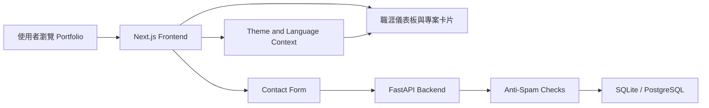

# Portfolio Dashboard

這是一個以 AI 結合個人專業知識開發的個人職涯作品集儀表板，也是職前訓練第二份作業。

專案旨在以前端 `Next.js`、`TypeScript` 與後端 `FastAPI` 整合實作，展示個人背景、職涯軌跡、技能概況、專案作品和反饋意見的收集。

目前作品定位是「資料工程 / 後端工程 / 分析應用」方向的 portfolio。內容聚焦於資料工程、ETL 資料流水線、SQL 分析、Power BI / Tableau 儀表板、Python 自動化，以及過去 C# / Java 後端開發經驗。# Portfolio Dashboard

🔗 [**Live Demo**](https://17s-portfolio.vercel.app)

---

## 系統 Infography

| 面向 | 目前版本內容 |
| --- | --- |
| 專案定位 | 職前訓練第二份作業，個人 Portfolio Dashboard |
| 前端技術 | Next.js 16、React 19、TypeScript、CSS Variables、Responsive Layout |
| 後端技術 | FastAPI、SQLAlchemy、Pydantic、SQLite，本地可切 PostgreSQL / Supabase |
| 作品展示 | Previous Projects、Developed Projects、Developing / Planned Projects |
| 聯絡表單 | 後端 API 儲存留言，展示版尚未串接正式 email 寄送 |
| 防 spam | Honeypot、IP 限流、Email 限流、重複訊息偵測、連結數限制、250 字留言上限 |
| 部署規劃 | 前端 Vercel，後端可部署至 Cloud Run，資料庫可銜接 Supabase PostgreSQL |



---

## 目前功能

- **職涯儀表板**：首頁以 dashboard 方式呈現工作年資、專案分類、核心技術與目前求職狀態。
- **中英文內容切換**：主要頁面支援英文與繁體中文顯示，包含職涯節點、專案描述、公司名稱與地點。
- **深淺色主題**：使用 CSS variables 管理主題色彩與版面狀態。
- **生涯軌跡**：以工作與教育兩種色彩區分經歷，並提供中英文內容。
- **專案展示**：區分過往企業實作、職前訓練完成作業、以及未來規劃中的候選專案。
- **聯絡表單**：可將留言提交至 FastAPI backend，並透過基礎防 spam 機制過濾異常提交。
- **技術提示與狀態文案**：針對 demo contact form 補充明確說明，避免誤導使用者以為已完成正式寄信服務。

---

## 專案展示內容

| 分類 | 內容 |
| --- | --- |
| Previous Projects | Donor Analytics Pipeline，聚焦 St Peter's College 募款資料來源與近 20 年 SQL Server 捐款資料建模 |
| Developed Projects | AI 開發儀表板實踐、個人 Portfolio Dashboard、Hugging Face AI 繪圖生成器、多元線性迴歸實作 |
| Developing / Planned Projects | 預約 App 與 LINE Bot 推播、司法機關裁罰案件爬蟲數據分析、旅遊規劃建議配合爬蟲實踐 |

---

## 技術架構

```text
17s_portfolio/
├── frontend/
│   ├── src/app/                 # Next.js App Router
│   ├── src/components/          # Hero, Projects, Skills, Experience, Contact
│   ├── src/config.ts            # Frontend API endpoint configuration
│   └── package.json
├── backend/
│   ├── main.py                  # FastAPI routes and anti-spam logic
│   ├── models.py                # SQLAlchemy models
│   ├── schemas.py               # Pydantic schemas
│   ├── seed.py                  # Initial portfolio data
│   └── requirements.txt
├── deployment_guide.md
├── run.bat
└── README.md
```

---

## 本機執行

### 方式一：Windows 一鍵啟動

在專案根目錄執行：

```bat
run.bat
```

此腳本會分別啟動：

- FastAPI backend: [http://localhost:8000](http://localhost:8000)
- Next.js frontend: [http://localhost:3000](http://localhost:3000)

### 方式二：手動啟動

啟動後端：

```powershell
cd backend
.venv\Scripts\Activate.ps1
python -m uvicorn main:app --port 8000 --reload
```

後端 API 文件：

```text
http://localhost:8000/docs
```

啟動前端：

```powershell
cd frontend
npm ci
npm run dev
```

前端頁面：

```text
http://localhost:3000
```

`npm ci` 會依照 `package-lock.json` 安裝固定版本，適合 fresh clone 後使用。若 Windows PowerShell 擋下 `npm`，可改用 Command Prompt，或執行 `npm.cmd ci` 與 `npm.cmd run dev`。

---

## 後端防 spam 設定

FastAPI contact endpoint 目前支援以下環境變數：

| 變數 | 預設值 | 說明 |
| --- | --- | --- |
| `CONTACT_IP_LIMIT_1M` | `5` | 同 IP 每 1 分鐘最多 5 則 |
| `CONTACT_EMAIL_LIMIT_10M` | `3` | 同 email 每 10 分鐘最多 3 則 |
| `CONTACT_MAX_LINKS` | `3` | 單則留言最多 3 個連結 |
| `CONTACT_HASH_SALT` | `portfolio-contact` | IP / email / message hash salt |
| `ALLOWED_ORIGINS` | `http://localhost:3000` | 允許呼叫 backend 的 frontend origin |

留言內容限制為 10 到 250 字，並包含 honeypot 欄位與重複訊息偵測。這些機制只能降低低成本 spam，正式上線仍建議加入更完整的監控、驗證與資料庫層級保護。

---

## 部署摘要

- Frontend: Vercel
- Backend: Google Cloud Run 或其他可執行 FastAPI 的平台
- Database: 本地 SQLite，正式環境可使用 Supabase PostgreSQL
- CORS: 透過 `ALLOWED_ORIGINS` 指定正式 frontend 網域

更完整流程可參考 [deployment_guide.md](./deployment_guide.md)。

---

## 開發收穫

- 重新熟悉 Next.js 前端與 FastAPI 後端的分工整合。
- 實作作品集常見的內容需求管理，包含專案卡片、技能資料、職涯時間軸與聯絡表單。
- 透過 Contact API 練習表單驗證、資料儲存、CORS 設定與基礎防 spam 設計。
- 建立可部署的前後端結構，並保留後續銜接 Supabase PostgreSQL 與雲端後端服務的空間。
- 透過 Vercel、GitHub 與 Supabase 等免費或低成本資源，建立可持續部署、版本管理與資料儲存的作品集流程。
