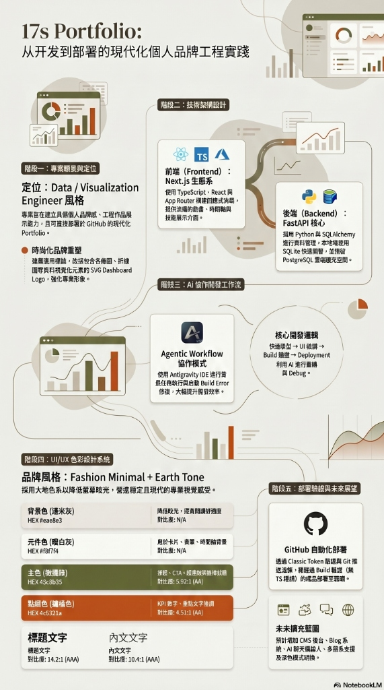

# Yichi Nien - Portfolio Website (17s_portfolio)

A premium, state-of-the-art developer portfolio website featuring a **Next.js** frontend and a **FastAPI (Python)** backend, styled using vanilla CSS variables for a clean, earthy beige-grey design system with olive green highlights.

🔗 **Live Demo**: [https://17s-portfolio.vercel.app](https://17s-portfolio.vercel.app)

---

## 📊 Development Milestone Infographic


---

## 📊 Project Infographic



---

## 📁 Project Structure

This repository is split into two primary components:
- **/frontend**: Next.js (TypeScript, App Router) web application.
- **/backend**: FastAPI (Python) backend server providing project data, skills telemetry, and handling contact form inquiries with an SQLite database.

---

## 🚀 How to Run the Application

There are two ways to start the project.

### Method 1: One-Click Startup (Recommended for Windows)

In the root folder, simply double-click the **`run.bat`** file:
```bash
run.bat
```
This batch script will automatically:
1. Launch the Python FastAPI backend in a separate terminal window at [http://localhost:8000](http://localhost:8000)
2. Launch the Next.js development server in another terminal window at [http://localhost:3000](http://localhost:3000)

---

### Method 2: Manual Startup (From Terminals)

If you prefer to run the components manually, open two terminal windows:

#### 1. Run the Backend Server
First, open a terminal, navigate to the `/backend` directory, and start the Python FastAPI server:
```bash
# Navigate to the backend directory
cd backend

# Activate virtual environment (Windows PowerShell)
.venv\Scripts\Activate.ps1

# Activate virtual environment (Windows CMD)
.venv\Scripts\activate.bat

# Start the FastAPI application
python -m uvicorn main:app --port 8000 --reload
```
The backend API documentation will be available at [http://localhost:8000/docs](http://localhost:8000/docs).

#### 2. Run the Frontend Server
Open a second terminal, navigate to the `/frontend` directory, and start the Next.js development server:
```bash
# Navigate to the frontend directory
cd frontend

# Run the Next.js development server
npm run dev
```
Open your browser and visit [http://localhost:3000](http://localhost:3000) to see the web application in action.
