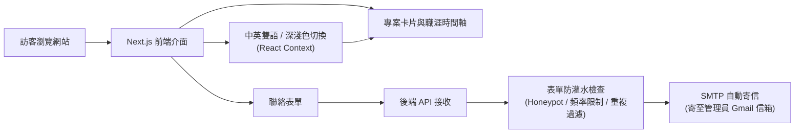

# Portfolio Dashboard

這是一個採用前後端分離架構打造的個人作品集網站。前端使用 Next.js 16、React 19 與 TypeScript，後端使用 FastAPI (Python)。除了彙整個人的技術背景、專案成果與工作經歷外，也實作了具備防灌水保護的 Email 聯絡表單，展現資料處理、後端 API 與全端整合能力。

🔗 [**Live Demo 網頁體驗**](https://17s-portfolio.vercel.app)

---

## 💡 網站開發動機 (Motivation)

1. **作品與技能集中展示**：建立一個乾淨、現代化的個人儀表板，讓訪客快速了解我的專案經驗、技術堆疊與求職狀態。
2. **保護隱私的聯絡管道**：避免在公開網頁上直接放個人 Email 導致被垃圾信爬蟲收割，改用後端代寄信的方式，並加上基礎防灌水機制。
3. **輕量好維護的架構**：留言直接轉寄 Email，不需要額外維護資料庫伺服器，前後端都能輕鬆部署到 Vercel 或各家雲端平台。

---

## 🏗️ 技術架構與資料流 (Technical Architecture)

### 技術選型

| 面向 | 選用技術 |
| --- | --- |
| **前端框架** | Next.js 16 (App Router)、React 19、TypeScript |
| **樣式設計** | 原生 CSS 變數 (CSS Variables)、毛玻璃光影效果、RWD 響應式版面 |
| **後端 API** | FastAPI、Pydantic (資料驗證)、Python smtplib / Nodemailer |
| **狀態管理** | React Context (支援中英雙語切換與深淺色主題切換) |
| **安全防護** | Honeypot 機器人陷阱、IP/Email 發送頻率限制、重複內容過濾 |
| **雲端部署** | 前端 Vercel、後端可直接容器化部署至 Cloud Run 或 Render |

### 系統運作流程


```mermaid
flowchart LR
    A["訪客瀏覽網站"] --> B["Next.js 前端介面"]
    B --> C["專案卡片與職涯時間軸"]
    B --> D["中英雙語 / 深淺色切換\n(React Context)"]
    D --> C
    B --> E["聯絡表單"]
    E --> F["後端 API 接收"]
    F --> G["表單防灌水檢查\n(Honeypot / 頻率限制 / 重複過濾)"]
    G --> H["SMTP 自動寄信\n(寄至管理員 Gmail 信箱)"]
```

### 專案目錄結構

```text
17s_portfolio/
├── frontend/
│   ├── src/app/                 # Next.js 頁面與 API Routes (包含 contact 寄信 API)
│   ├── src/components/          # 頁面元件 (Hero, Projects, Skills, Experience, Contact)
│   ├── src/data/                # 網站靜態多語系資料 (portfolioData.ts)
│   ├── src/config.ts            # API 網址設定
│   ├── .env.local               # SMTP 寄信帳密設定 (本地環境變數)
│   └── package.json
├── backend/
│   ├── main.py                  # FastAPI 路由、防灌水邏輯與郵件寄送
│   ├── data.py                  # 後端資料結構
│   ├── schemas.py               # Pydantic 資料型別驗證
│   └── requirements.txt         # 後端套件清單
├── docs/
│   └── deployment_guide.md      # 完整雲端部署步驟
├── run.bat                      # Windows 一鍵啟動前後端腳本
└── README.md
```

---

## ⚡ 核心功能 (Core Features)

- **職涯儀表板**：首頁直觀呈現工作年資、專案分類、核心技術與求職狀態。
- **中英雙語即時切換**：透過 Context 實現全站一鍵切換繁體中文與英文。
- **深淺色主題切換**：支援暗黑模式與明亮模式，搭配毛玻璃效果與微動畫。
- **職涯歷程時間軸**：以不同色彩區分工作與教育經歷，清晰呈現個人成長背景。
- **即時 Email 聯絡表單**：訪客送出表單後，後端會自動寄信通知作者，不需將 Email 公開在網頁上。

---

## ⚙️ 環境變數與安全設定 (Configuration)

### 設定寄信帳密 (`frontend/.env.local`)

若要啟用表單寄信功能，請在 `frontend/.env.local` 填入 Gmail SMTP 設定：

```env
SMTP_HOST=smtp.gmail.com
SMTP_PORT=587
SMTP_USER=your_email@gmail.com
SMTP_PASSWORD=your_16_char_app_password
```

> **📌 密碼取得方式**：`SMTP_PASSWORD` 請使用 Google 帳號產生的 **16 位應用程式密碼**（需先開啟 Google 帳號兩步驟驗證，至 [Google 應用程式密碼頁面](https://myaccount.google.com/apppasswords) 即可新增一組 16 位密碼）。

### 表單防灌水機制

| 機制名稱 | 白話說明 |
| --- | --- |
| **Honeypot（防機器人隱藏欄位）** | 表單中埋入人類看不到的隱藏欄位，自動填表機器人若填寫即會被系統自動阻擋。 |
| **IP 發送頻率限制** | 同一個 IP 限制 1 分鐘內最多送出 5 次，避免被程式惡意刷留言。 |
| **Email 發送限制** | 同一個 Email 限制 10 分鐘內最多送出 3 次。 |
| **重複內容過濾** | 24 小時內若送出完全相同的留言內容會自動過濾，防止按鈕連點造成重複發信。 |
| **字數與網址限制** | 限制留言內容在 10 ~ 250 字之間，且最多包含 3 個網址，降低廣告垃圾信機率。 |

---

## 🚀 本機啟動方式 (Getting Started)

### 方式一：Windows 一鍵啟動（推薦）

在專案根目錄直接點擊或執行：

```bat
run.bat
```

腳本會自動檢查環境並同時開啟：
- **FastAPI 後端**：`http://localhost:8000`（API 文件：`http://localhost:8000/docs`）
- **Next.js 前端**：`http://localhost:3000`

### 方式二：手動分開啟動

**1. 啟動後端：**
```powershell
cd backend
python -m venv .venv
.venv\Scripts\Activate.ps1
pip install -r requirements.txt
python -m uvicorn main:app --port 8000 --reload
```

**2. 啟動前端：**
```powershell
cd frontend
npm ci
npm run dev
```

---

## 🌐 雲端部署步驟 (Deployment)

- **前端部署至 Vercel**：
  1. 將專案 Push 至 GitHub 並連結到 Vercel。
  2. 設定 Root Directory 為 `frontend`。
  3. 在 Vercel 後台的 Environment Variables 加入 `SMTP_USER` 與 `SMTP_PASSWORD` 即完成部署。
- **後端部署至 Google Cloud Run 或 Render**：
  - 支援將 FastAPI 打包為 Docker 容器部署。
  - 在後端環境變數中設定 `ALLOWED_ORIGINS` 填入前端網址以通過跨域 (CORS) 檢查。

完整部署說明請參考 [docs/deployment_guide.md](./docs/deployment_guide.md)。

---

## 💡 開發收穫與心得 (Takeaways)

- **前後端整合與型別串接**：熟悉 Next.js App Router 與 FastAPI RESTful API 之間的資料傳遞、狀態處理與 TypeScript 型別對齊。
- **雙語與主題切換實作**：使用原生 React Context 與 CSS 變數實作無縫切換，不用依賴繁重的第三方套件即可達成乾淨架構。
- **表單驗證與防灌水設計**：實作簡單實用的防垃圾信邏輯（Honeypot 陷阱、頻率限制與重複過濾），串接 SMTP 即時寄信。
- **兼顧隱私與維護成本**：訪客留言直接轉寄信箱，省去額外架設與維護資料庫伺服器的麻煩，降低維運成本與資安風險。
