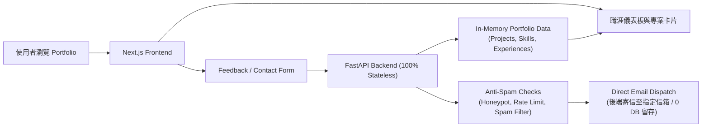

# Portfolio Dashboard

這是一個前後端分離架構的個人作品集網站，前端使用 Next.js、TypeScript，後端使用 FastAPI、Python 建立，全面採用**無資料庫（0 Database / 100% Stateless）**架構，用來整理個人技術背景、專案經驗與展現數據工程 / 後端自動化與全端開發的能力。

網站除了呈現作品展示、職涯時間軸、技能整理與教育背景，也提供無資料庫留存、直接寄送 Email 的反饋建議功能，證明我擁有將專案以極簡、易維護、易部署、重視隱私與無狀態（Stateless）的規劃能力。

🔗 [**Live Demo**](https://17s-portfolio.vercel.app)

---

## 系統 Infography

| 面向 | 目前版本內容 |
| --- | --- |
| 前端技術 | Next.js 16、React 19、TypeScript、CSS Variables、Responsive Layout |
| 後端技術 | FastAPI、Pydantic、Python smtplib，**0 Database / 純靜態結構化資料提供** |
| 作品展示 | Previous Projects、Developed Projects (包含 PSJJV、BI-RMP 等 9 個專案)、Developing / Planned Projects |
| 聯絡/反饋 | 後端直接寄送 Email 至作者信箱，**0 資料庫留存 (Zero DB Persistence)**，保護訪客隱私 |
| 防 spam | Honeypot、IP 限流、Email 限流、重複訊息偵測、連結數限制、250 字留言上限 |
| 部署優勢 | 前端 Vercel，後端可無痛部署至任何 Serverless / Container 平台 (Cloud Run / Render)，**零資料庫連線與維護負擔** |


```mermaid
flowchart LR
    A["使用者瀏覽 Portfolio"] --> B["Next.js Frontend"]
    B --> C["職涯儀表板與專案卡片"]
    B --> D["Feedback / Contact Form"]
    D --> E["FastAPI Backend (100% Stateless)"]
    E --> F["Anti-Spam Checks\n(Honeypot, Rate Limit, Spam Filter)"]
    F --> G["Direct Email Dispatch\n(後端寄信至指定信箱 / 0 DB 留存)"]
    E --> H["In-Memory Portfolio Data\n(Projects, Skills, Experiences)"]
    H --> C
```

---

## 目前功能

- **職涯儀表板**：首頁以 dashboard 方式呈現工作年資、專案分類、核心技術與目前求職狀態。
- **中英文內容切換**：主要頁面支援英文與繁體中文雙語切換，包含職涯節點、專案描述、公司名稱與地點。
- **深淺色主題**：使用 CSS variables 管理主題色彩、毛玻璃光效與版面狀態。
- **生涯軌跡**：以工作與教育兩種色彩區分經歷，並提供中英文詳細內容。
- **直接郵件反饋 (Direct Email Feedback)**：訪客提交反饋後，後端透過郵件安全發送至作者信箱，**完全不將任何留言內容寫入資料庫**，且收件者信箱寫死在後端，絕不外洩至前端客戶端。
- **100% 無狀態極簡架構 (0 Database)**：作品展示、技能與經歷資料改由結構化資料模組提供，免除資料庫鎖死、遷移與連線遺失風險。
- **完整防 spam 機制**：結合 Honeypot 蜜罐陷阱、IP 頻率限制、Email 限流、重複訊息防範與連結數上限。

---

## 專案展示內容

| 分類 | 專案名稱 | 內容摘要與架構特色 |
| --- | --- | --- |
| Previous Projects | **Donor Analytics Pipeline** | 聚焦聖彼得大學近 20 年 SQL Server 捐款數據，進行預測建模、高額捐款特徵分析與 Power BI / Excel 報告。 |
| Developed Projects | **台灣地方治安統計分析平台 (PSJJV)** | 結合 Next.js 儀表板、Python 自動化 ETL 與 Turso 雲端分散式 SQLite。GitHub Actions 每月自動下載內政部犯罪資料 (代號 9603) 並執行完整性加總審計。 |
| Developed Projects | **BI-RMP 商業聲譽與輿情風險平台** | 整合 PTT (SearXNG + aiohttp)、Google Maps 與 Threads (Playwright) 輿情爬蟲，LINE/LIFF 服務入口，n8n 流程調度，FastAPI 任務去重與 Supabase PostgreSQL 持久化。 |
| Developed Projects | **個人 Portfolio Dashboard** | 職前訓練第二份作業。Next.js + TypeScript + FastAPI，具備直接 Email 寄送、零 DB 留言儲存、防 spam 與雙語切換。 |
| Developed Projects | **50 Startups 獲利預測與特徵分析** | CRISP-DM 決策平台，整合自製 OLS 多元線性迴歸、貝氏目標編碼與預測區間互動儀表板。 |
| Developed Projects | **產業機器學習互動體驗站** | 互動式機器學習導引，支援多模型指標與決策邊界比較，並串接 Gemini AI 助理提供情境解釋。 |
| Developed Projects | **Hugging Face AI 繪圖生成器** | Streamlit 串接 FLUX.1 Schnell 與 SDXL，支援多圖並行、雙語介面與本機 Demo 模式。 |
| Developed Projects | **線性迴歸與空污異常監測實作** | CRISP-DM 框架的線性迴歸與中部地區 AQI 空污異常偵測展示工具。 |
| Developed Projects | **AI 開發儀表板實踐** | 互動式前端網頁儀表板，具備毛玻璃擬態 UI、滑鼠折射光影特效與即時數位日曆時鐘。 |
| Developing / Planned Projects | **預約 App 與 LINE Bot 推播** | 候選構想：結合預約流程、LINE Bot 推播與 n8n 自動化。 |
| Developing / Planned Projects | **旅遊規劃建議配合爬蟲實踐** | 候選構想：搭配爬蟲蒐集旅遊資訊，練習資料整理、比較與行程規劃決策素材。 |

---

## 技術架構

```text
17s_portfolio/
├── frontend/
│   ├── src/app/                 # Next.js App Router
│   ├── src/components/          # Hero, Projects, Skills, Experience, Contact, LanguageContext
│   ├── src/config.ts            # Frontend API endpoint configuration
│   └── package.json
├── backend/
│   ├── main.py                  # Stateless FastAPI routes, anti-spam logic, direct email dispatch
│   ├── data.py                  # Structured portfolio data (0 DB, in-memory catalog)
│   ├── schemas.py               # Pydantic schemas (Project, Skill, Experience, ContactResponse)
│   └── requirements.txt         # Minimal lightweight dependencies (no DB ORM needed)
├── docs/
│   └── deployment_guide.md
├── run.bat
└── README.md
```

---

## 本機執行

### 方式一：Windows 一鍵啟動

在專案根目錄執行：

```bat
run.bat
```

此腳本會分別啟動：

- FastAPI backend: [http://localhost:8000](http://localhost:8000)
- Next.js frontend: [http://localhost:3000](http://localhost:3000)

### 方式二：手動啟動

啟動後端：

```powershell
cd backend
.venv\Scripts\Activate.ps1
python -m uvicorn main:app --port 8000 --reload
```

後端 API 文件：

```text
http://localhost:8000/docs
```

啟動前端：

```powershell
cd frontend
npm ci
npm run dev
```

前端頁面：

```text
http://localhost:3000
```

`npm ci` 會依照 `package-lock.json` 安裝固定版本，適合 fresh clone 後使用。若 Windows PowerShell 擋下 `npm`，可改用 Command Prompt，或執行 `npm.cmd ci` 與 `npm.cmd run dev`。

---

## 後端防 spam 與反饋寄信設定

FastAPI feedback / contact endpoint 支援以下環境變數配置：

| 變數 | 預設值 | 說明 |
| --- | --- | --- |
| `SMTP_HOST` | *(選填)* | SMTP 伺服器主機 (如 `smtp.gmail.com`、`smtp.office365.com`) |
| `SMTP_PORT` | `587` | SMTP 伺服器連接埠 |
| `SMTP_USER` | *(選填)* | SMTP 登入帳號 |
| `SMTP_PASSWORD` | *(選填)* | SMTP 密碼或應用程式專用密碼 |
| `SMTP_USE_TLS` | `true` | 是否啟用 STARTTLS 加密 |
| `CONTACT_IP_LIMIT_1M` | `5` | 同 IP 每 1 分鐘最多 5 則 |
| `CONTACT_EMAIL_LIMIT_10M` | `3` | 同 email 每 10 分鐘最多 3 則 |
| `CONTACT_MAX_LINKS` | `3` | 單則留言最多 3 個連結 |
| `CONTACT_HASH_SALT` | `portfolio-contact` | IP / email / message hash salt |
| `ALLOWED_ORIGINS` | `http://localhost:3000` | 允許呼叫 backend 的 frontend origin |

> **隱私與安全說明**：
> - 收件者信箱寫死在後端內部 (`main.py`)，不會暴露在任何 API 回應、API 說明文件或前端 JavaScript bundle 中。
> - 訪客的反饋訊息透過後端直接寄出，**完全不儲存於任何資料庫中** (0 DB persistence)。
> - 在本機開發或未設定外部 SMTP 帳號的展示環境下，後端會將通知安全記錄於伺服器 log 中，確保服務穩定不拋出異常。
